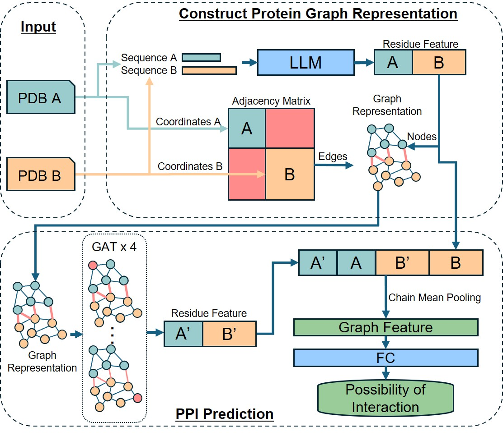

# SpatialPPI-2.0

Protein-protein interactions (PPIs) are fundamental to cellular functions, and accurate prediction of these interactions is crucial to understanding biological mechanisms and facilitating drug discovery. SpatialPPI 2.0 is an advanced graph neural network-based model that predicts PPIs by utilizing inter-residue contact maps derived from both structural and sequence data. By leveraging the comprehensive PINDER dataset, which includes interaction data from the RCSB PDB and the AlphaFold database, SpatialPPI 2.0 improves the specificity and robustness of the prediction of PPI. Unlike the original SpatialPPI, the updated version employs interaction interface prediction as an intermediate step, allowing for a more effective assessment of interactions between isolated proteins. The model utilizes Graph Attention Networks (GAT) and Graph Convolutional Networks (GCN) to capture both local and global structural features. SpatialPPI 2.0 outperforms several state-of-the-art PPI and interface predictors, demonstrating superior accuracy and reliability. Furthermore, the model shows robustness when using structures predicted by AlphaFold, indicating its potential to predict interactions for proteins without experimentally determined structures.
SpatialPPI 2.0 offers a promising solution for accurate prediction of PPIs, providing insight into protein function and supporting advances in drug discovery and synthetic biology. 



## Prepare Environment


We use [Apptainer](https://apptainer.org/) in this project. You can find the `Apptainer` file in `env/Apptainer`.

Otherwise, if you look at the `Apptainer` file, it can be easily transfer to a `Dockerfile`.

Or you can install them manually.

## Train Model

To replicate our research, please follow these steps:

### Get dataset

### 1. Download PINDER dataset. 

You can refer to [here](https://github.com/pinder-org/pinder?tab=readme-ov-file#%EF%B8%8F-getting-the-dataset)

```
export PINDER_RELEASE=2024-02
export PINDER_BASE_DIR=~/my-custom-location-for-pinder/pinder
pinder_download
```

#### Set the path in `config/default.yaml`

Change `data_root` to `~/my-custom-location-for-pinder/pinder/2024-02/pdbs`

You should change the line 7 and line 44 if you use default config file.

### 2. Download BioGRID

```
wget -O datasets/BIOGRID-ALL-4.4.238.tab3.zip https://downloads.thebiogrid.org/Download/BioGRID/Release-Archive/BIOGRID-4.4.238/BIOGRID-ALL-4.4.238.tab3.zip
unzip -d datasets/ datasets/BIOGRID-ALL-4.4.238.tab3.zip
```

### 3. Generate dataset

```
python dataset_generator.py --split train --workers 8 --biogrid datasets/BIOGRID-ALL-4.4.238.tab3.txt
```


### Train Interface Predictor

```
python main.py --task train_interface
```


### Train Interaction Predictor

```
python main.py --task train_interaction
```


## Inference Protein-Protein Interaction

```
python inference_AF_complex.py --cif [PATH TO CIF]
```


## Inference AlphaFold Predicted protein complex

```
python inference.py --pdb_a [PATH TO PDB] --pdb_b [PATH TO PDB] --output out.json
```


## License
[](https://opensource.org/licenses/Apache-2.0)

